# 一、Redis简介

## ①NoSQL

```
关系型数据库。
	（1）数据结构：结构化的，对数据结构有严格的要求。如：MySQL，存储什么类型的数据在一开始就规定好了。
	（2）数据关联：数据与数据之间以二维表格的形式呈现。表与表之间有关联关系。
	（3）查询方式：有统一的查询语言，即SQL
	（4）事务特性：所有的关系型数据库都满足ACID的特性
	
非关系型数据库。
	（1）数据结构：非结构化的，对数据结构没有严格的要求。如：kv型数据库Redis，文档型数据库MongoDB,列类型，图类型
	（2）数据关联：数据与数据之间没有关联关系
	（3）查询方式：没有统一的查询语言，每种非关系型数据库的查询语句都不一样
	（4）事务特性：无法完全满足ACID的特性，只能完成简单的事务功能BASE
```

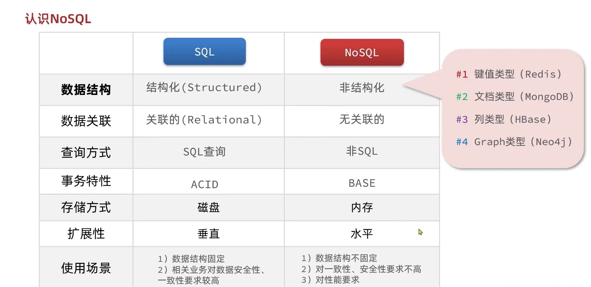


## ②认识Redis

```markdown
Redis特性

1. 键值型：value支持多种不同的数据结构

2. 单线程：每个命令天然具备原子性

3. 速度快：基于内存，IO多路复用

4. 持久化：数据存储在内存不安全，会定期的持久化到内存

5. 主从集群

6. 分片集群

7. 多语言客户端：大多数语言都能操作Redis

```


## ③安装Redis

### Ⅰ、redis服务端

```markdown
1. 安装redis的依赖 yum install -y gcc tcl
	
2. 解压安装包 安装包一般上传到/usr/local/src

3. 解压完成进入文件夹执行 make && make install进行安装

4. 安装完，文件默认放在/usr/local/bin 

注意：需要把redis设置为守护进程与开机自启
```

### Ⅱ、Redis客户端

- 命令行客户端

  ```
  redis-cli -h 地址 -p 端口 -a 密码 
  
  redis-cli -h localhost -p 6379 -a Aa20341103
  ```

  

- 图形化客户端

  ```
  https://github.com/lework/RedisDesktopManager-Windows/releases
  
  如果连接不上需要开启防火墙放行端口6379
  ```

  

- 编程客户端

  ```
  使用编程语言操作redis数据库
  
  见'Redis的Java客户端'
  ```

  

# 二、Redis常用命令

### Ⅰ、Redis的数据结构

- Redis是一个键值型数据库，键一般是`String`类型，值的类型多种多样

  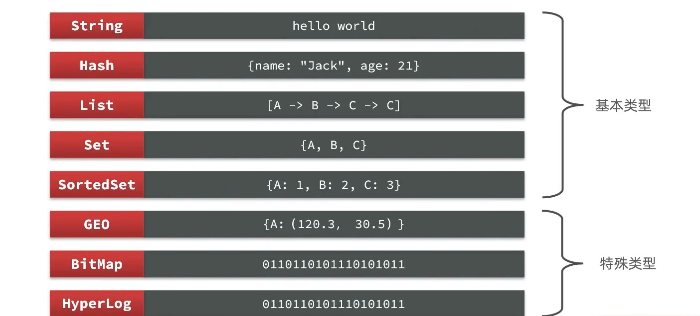


- ```
  help @类型  
  
  查看当前数据类型的命令
  ```

  

### Ⅱ、Redis通用命令

```
💘💘💘💘💘💘💘💘💘💘💘💘💘💘💘💘💘💘💘💘💘💘💘💘💘💘💘💘💘💘💘💘💘💘💘💘💘💘💘💘💘💘💘💘💘💘

💟KEYS *：模糊查询，因为Redis是单线程的，数据大了之后其他命令就会阻塞，所以生产环境不用

💟DEL key ：删除key

💟EXISTS key ：判断是key否存在

💟EXPIRE key ：给key设置有效期，到期字段删除

💟TTL key ：查看key的有效期
			🎁'-1' : 代表永久有效
			🎁'-2' : 代表有效期已过，被删除了

```


### Ⅲ、String类型命令

```
💌💌💌💌💌💌💌💌💌💌💌💌💌💌💌💌💌💌💌💌💌💌💌💌💌💌💌💌💌💌💌💌💌💌💌💌💌💌💌💌💌💌💌💌💌💌

🔞当value是字符串时，根据存储的格式不同，又分为三类。

1️⃣string：普通字符串
	
2️⃣int：整型字符串。可以做自增自减操作
	
3️⃣float：浮点型字符串，可以做自增自减操作

⏹虽然格式不同，但是底层都是使用字节数组存储数据

🔞常用命令

💟SET:添加与修改都做

💟MSET:批量添加与修改

💟SETEX:添加或修改一个key,并设置有效期

💟SETNX:添加与一个key，key存在则不添加。

💟GET：获取

💟MGET：批量获取

💟INCR：让指定的整型key自增1

💟INCRBY ：让指定的整型key自增指定步长

💟INCRBYFLOAT：让指定的浮点型key自增指定步长
```


### Ⅳ、Hash类型命令

```
💌💌💌💌💌💌💌💌💌💌💌💌💌💌💌💌💌💌💌💌💌💌💌💌💌💌💌💌💌💌💌💌💌💌💌💌💌💌💌💌💌💌💌💌💌💌

🔞Hash类型的value，value的值也是一个键值对。相对于用string类型存储json字符串更加灵活，可以针对value的某个字段CRUD
```


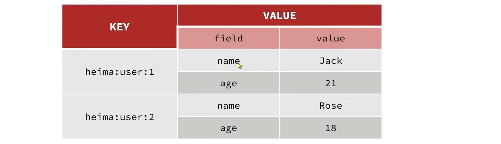

```
🔞常用命令

💟HSET key field value : 批量添加与修改

💟HGET key field : 获取

💟HGET key field ：批量获取

💟HGETALL key ：获取key的所有field与value

💟HKEYS key：获取key中的所有field

💟HVALS key ：获取key中的所有value

💟HINCRBY key filed N：让key的整型field自增指定步长N

💟HINCRBYFLOAT key filed N : 让key的浮点型field自增指定步长N

💟HSETNX key filed value:给key添加一个filed，filed存在则不添加 

```


### Ⅴ、List类型命令

```
💌💌💌💌💌💌💌💌💌💌💌💌💌💌💌💌💌💌💌💌💌💌💌💌💌💌💌💌💌💌💌💌💌💌💌💌💌💌💌💌💌💌💌💌💌💌

🔞Redis类似于Java中的LinkedList，可以看作双向链表结构，支持正向与反向检索
1️⃣有序
2️⃣元素可重复
3️⃣插入和删除快，查询相对慢
⏹常用于存储朋友圈点赞数，好友列表
```


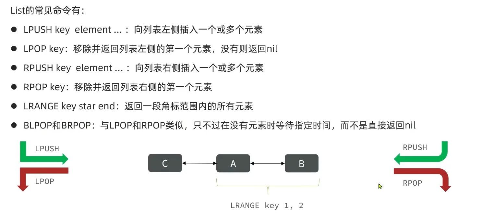


### Ⅵ、Set类型命令

```
💌💌💌💌💌💌💌💌💌💌💌💌💌💌💌💌💌💌💌💌💌💌💌💌💌💌💌💌💌💌💌💌💌💌💌💌💌💌💌💌💌💌💌💌💌💌


🔞Redis类似于Java中的HashSet,可以看作是value为null的HashMap
1️⃣无序
2️⃣元素不可重复
3️⃣查找快
4️⃣支持多个Set集合的交集，并集，差集操作

```


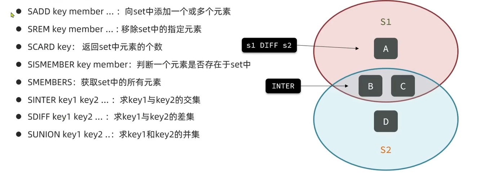

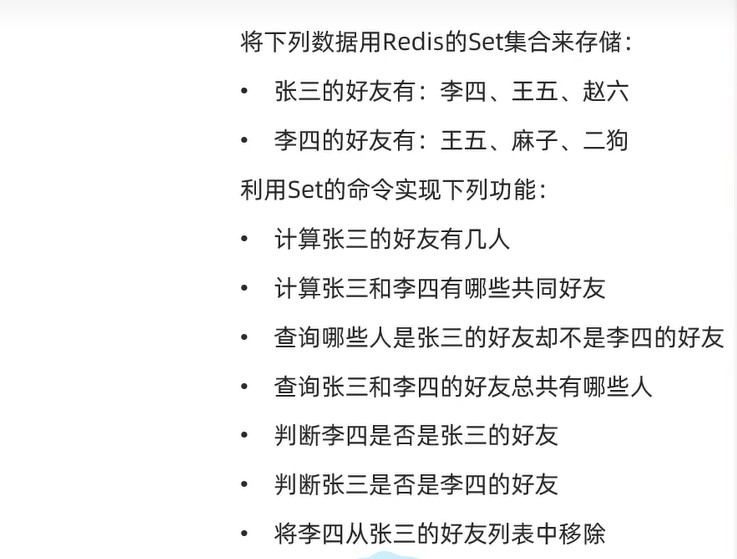

### Ⅶ、SortedSet类型命令

```
💌💌💌💌💌💌💌💌💌💌💌💌💌💌💌💌💌💌💌💌💌💌💌💌💌💌💌💌💌💌💌💌💌💌💌💌💌💌💌💌💌💌💌💌💌💌

🔞可排序的Set集合，与Java中的TreeSet类似。每一个元素都带有score属性，根据score属性来排序。
1️⃣可排序，默认升序
2️⃣无序性
3️⃣查询速度快
⏹因为SortedSet的可排序性，常被用来做排行榜功能
```


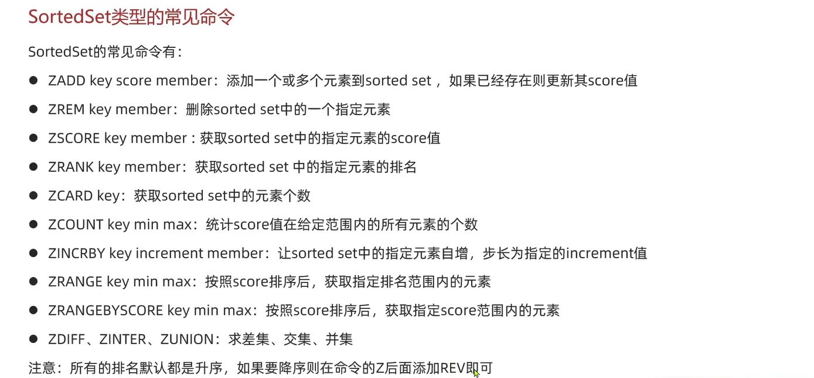


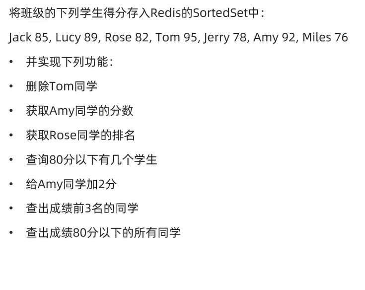


### Ⅷ、问题

```
💨💨💨💨💨💨💨💨💨💨💨💨💨💨💨💨💨💨💨💨💨💨💨💨💨💨💨💨💨💨💨💨💨💨💨💨💨

💘因为key是唯一的，key相同怎么办? 存储key时可以按照层级结构存储:   '项目名:类型:id'   (crm:user:1)

```

```
💨💨💨💨💨💨💨💨💨💨💨💨💨💨💨💨💨💨💨💨💨💨💨💨💨💨💨💨💨💨💨💨💨💨💨💨💨

Reids操作SortSet的score属性的命令都是闭区间的。查询时边界值怎么处理？如查询80以下的有几个人，因为是闭区间，所以包含了80
这个问题怎么解决
```


# 三、Redis的Java客户端

## ①客户端种类

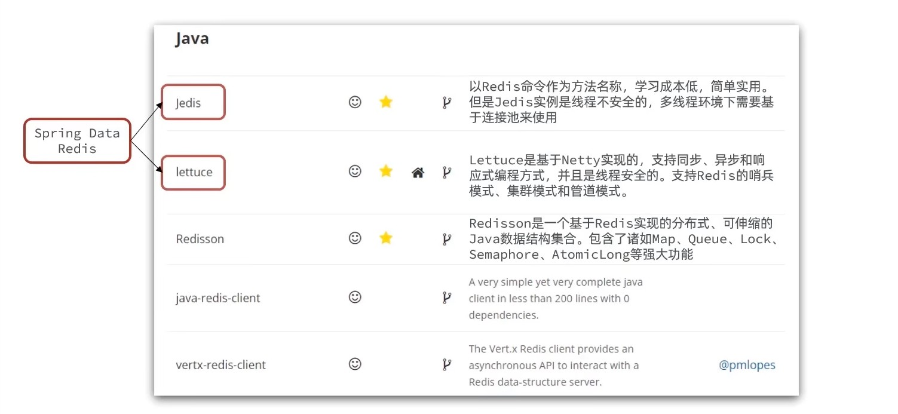

```
🉑单机环境用Jedis，Lettuce

🉑分布式环境用Redisson

🉑SpringDataRedis整合了Jedis与Lettuce
```


## ②Jedis快速入门

```
💫💫💫💫💫💫💫💫💫💫💫💫💫💫💫💫💫💫💫💫💫💫💫💫💫💫💫💫💫💫💫💫💫💫💫💫💫💫
1️⃣引入依赖
2️⃣简历连接
3️⃣测试
4️⃣释放资源

1. 普通方式：

public class JedisTest {
    private Jedis jedis;

    @BeforeEach
    public void initJedis(){
        jedis = new Jedis("43.143.231.137",6379);
        jedis.auth("Aa20341103");
        jedis.select(0);
    }

    @AfterEach
    public void destroy(){
        if (jedis != null) {
            jedis.close();
        }
    }

    @Test
    public void execution(){
        String name = jedis.get("name");
        System.out.println("name = " + name);
    }
}


2. 线程池方式

❗注意：一般都是用线程池的方式

public class JedisConnectFactory {
    public static final JedisPool jedisPool;
    static{
        JedisPoolConfig jedisPoolConfig = new JedisPoolConfig();
        jedisPoolConfig.setMaxTotal(8);
        jedisPoolConfig.setMaxIdle(8);
        jedisPoolConfig.setMinIdle(4);
        jedisPoolConfig.setMaxWaitMillis(1000);
        jedisPool = new JedisPool(jedisPoolConfig,"43.143.231.137",6379,1000,"Aa20341103");
    }
}
----------------------------------------------------------------------------

@BeforeEach
public void initJedis(){
	jedis = jedisPool.getResource();
}

@Test
.....

@AfterEach
.....
```


## ③SpringDataRedis快速入门

### Ⅰ、简介

```markdown
🛑🛑🛑🛑🛑🛑🛑🛑🛑🛑🛑🛑🛑

1. 整合了Redis的客户端。如提供了RedisTemplates这套标准来操作Redis，其底层具体的实现是由Jedis或Lettuce（默认）来做的。

2. 在整合的基础上做了其他扩展（暂时略，哨兵集成之类的反正写了也不懂）
```


### Ⅱ、如何使用

```markdown
🛑🛑🛑🛑🛑🛑🛑🛑🛑🛑🛑🛑🛑

1. Redis根据类型的不同对命令进行了分组，RedisTemplates也做了这件事情

2. 使用步骤

	（1）导入依赖，redis依赖与common-pool（创建连接池用）。
	
	（2）配置文件：端口，url，密码，连接池信息
	
	（3）注入RedisTemplates
```

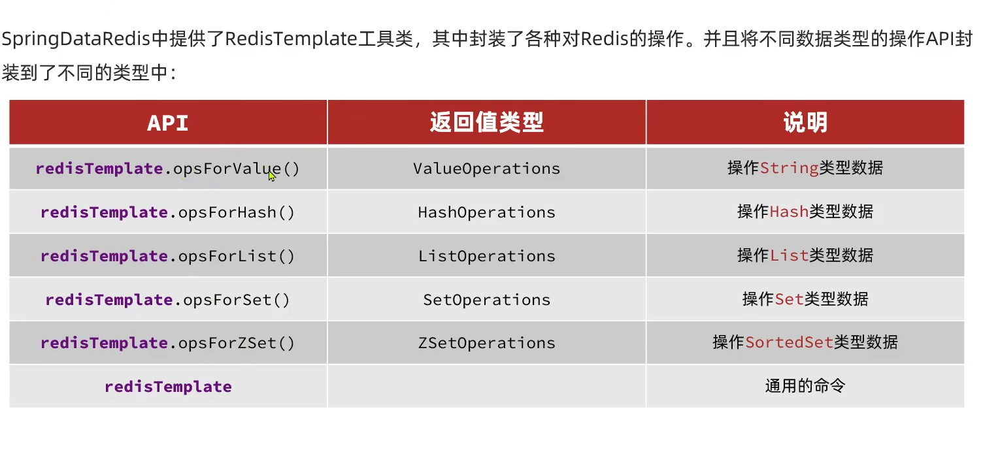

### Ⅲ、RedisTemplates的序列化

```
🛑🛑🛑🛑🛑🛑🛑🛑🛑🛑🛑🛑🛑

1️⃣使用Spring自动配置提供的RedisTemplates，会在代码中把key和value根据jdk序列化的规则序列化之后存到redis缓存中。
  导致在代码中手动写出来的key和redis实际缓存中的key不一致。没有所见即所得的效果。针对这种情况有两种解决方案

	⏹不使用jdk序列化规则。自定义RedisTemplates替换默认提供的RedisTemplates，并指定k与v的序列化规则。
		
	
	⏹使用自动配置给我们提供的StringRedisTemplates，即k与v都转成字符串存储
```

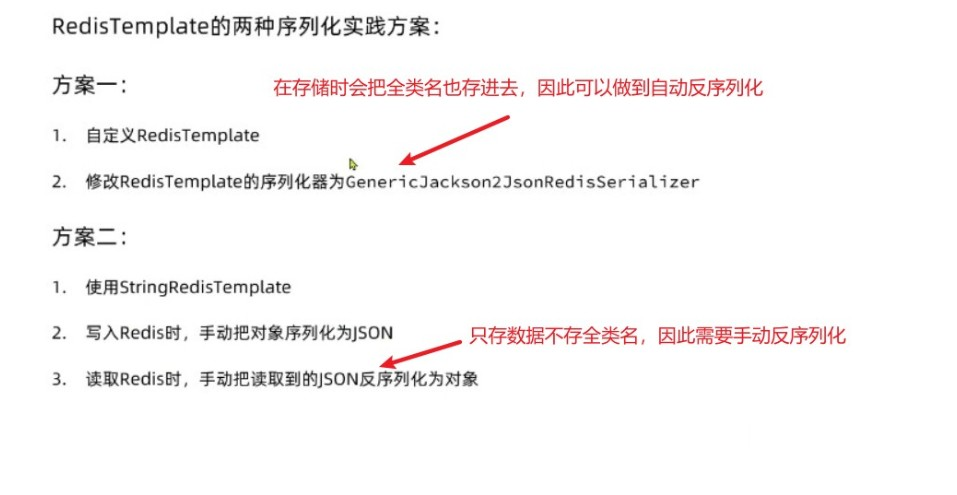

