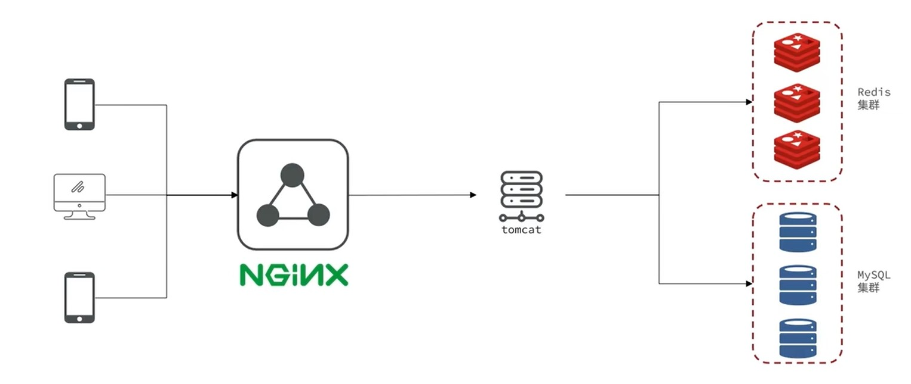
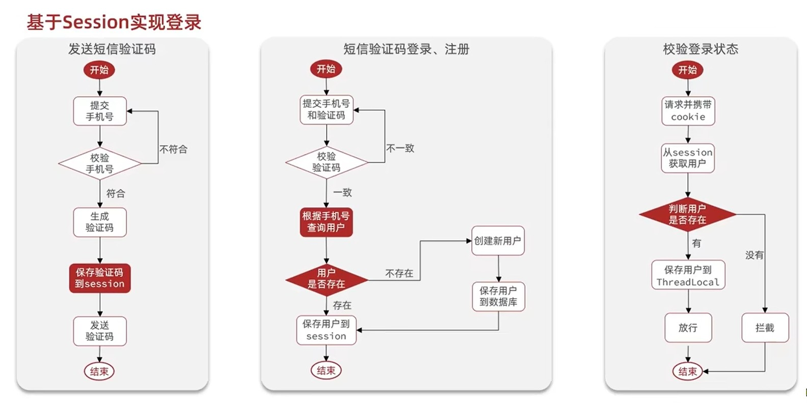
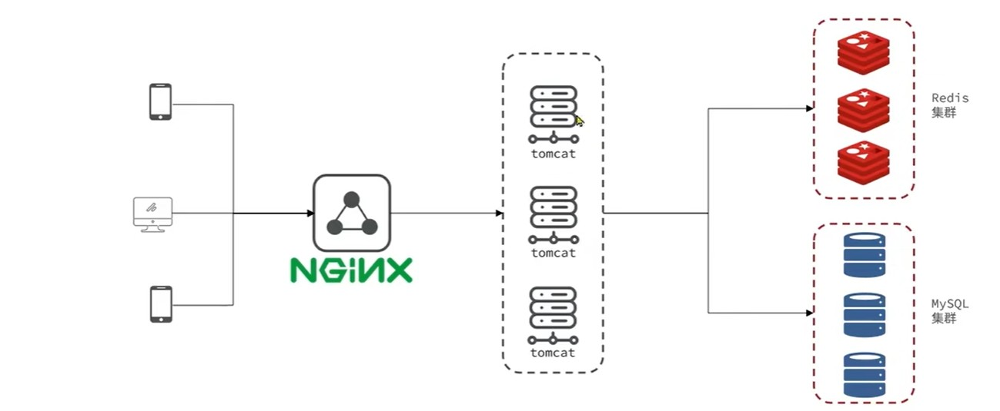
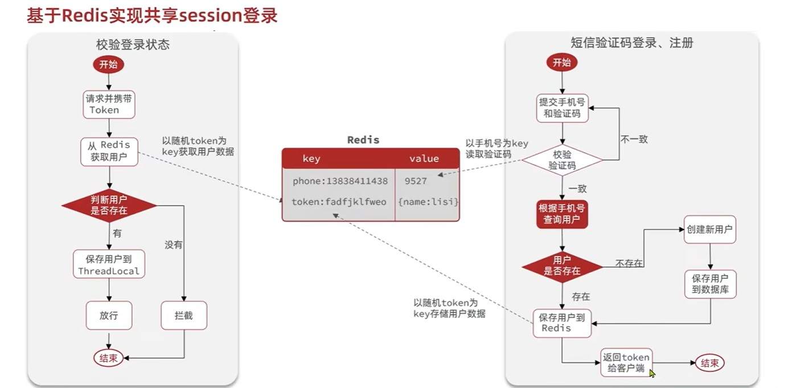

# 一、项目架构

# 二、基于Session实现登录

**代码省略**

## ①session的集群共享问题

> 多台Tomcat并不共享session，当请求切换到不同的服务器时会产生数据丢失的问题，所以需要代替session的东西，它需要基于内存，存储key，value数据，还要多个服务器数据共享。因为session是共享基于内存的键值对数据，Redis就正好符合这三个条件

## ②基于Redis的session登录

