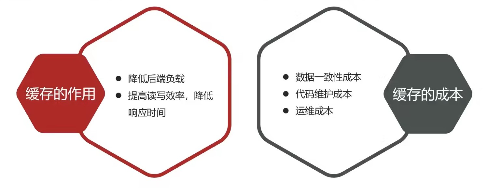
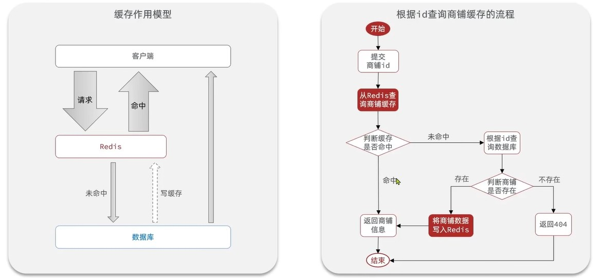
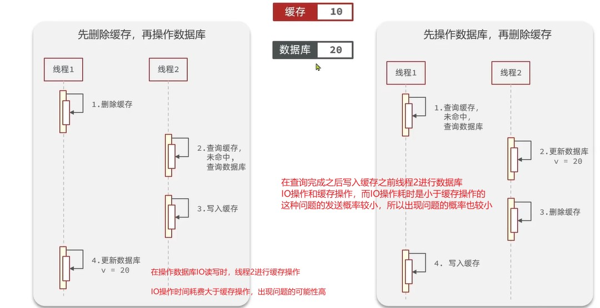

# 一、什么是缓存

> 缓存就是数据交换的缓冲区，是存储数据的临时空间，一般读写性能高

# 二、添加缓存的流程

# 三、缓存更新策略

## ① 主动更新策略的三种方式

❓❓数据库数据变更时操作缓存有三个问题需要考虑

1. 数据库变更时是删除缓存还是更新缓存
   - 更新缓存：数据库更新100次，缓存也更新100次，如果这个期间没有人来访问缓存，那这个更新是无意义的。
   - **删除缓存：不管数据库更新多少次，都是删除缓存，等有人访问时才从数据库查询数据添加缓存，类似懒加载**
2. 数据库变更时操作缓存如何保证数据库操作与缓存操作同时成功或同时失败
   - 单体系统：数据库操作与缓存操作放在一个事务
   - 分布式系统：利用TCC等分布式事务解决方案

3. 先操作缓存还是先操作数据库

   - **先操作数据库，再操作缓存**比先操作缓存再操作数据库发生线程安全问题的可能性低

     

## ②缓存更新策略的最佳方案

- 低一致性需求：使用redis的内存淘汰方案

- **高一致性需求：主动更新，并使用超时剔除作为兜底**

  > 读操作：缓存命中直接返回。未命中则查询数据库，写入缓存并设置超时时间。

  > 写操作：先写数据库再删除缓存，要确保数据库与缓存操作的原子性。

三、什么是缓存穿透

> 缓存穿透是指客户端的请求在缓存和数据库中都不存在，这样缓存永远都不会生效。请求直接打到数据库

**缓存空对象解决缓存穿透**

