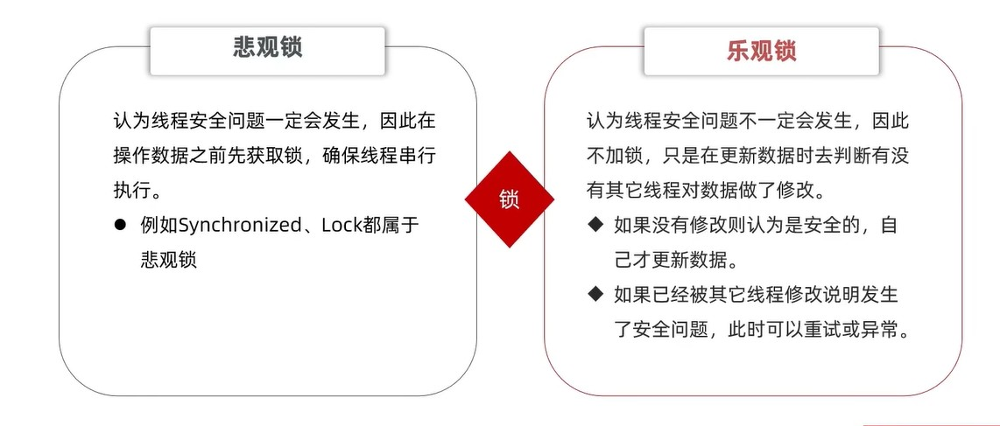
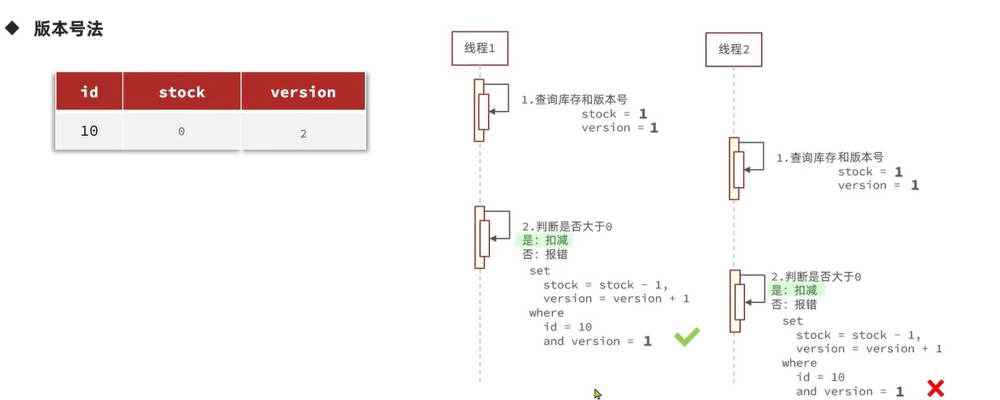
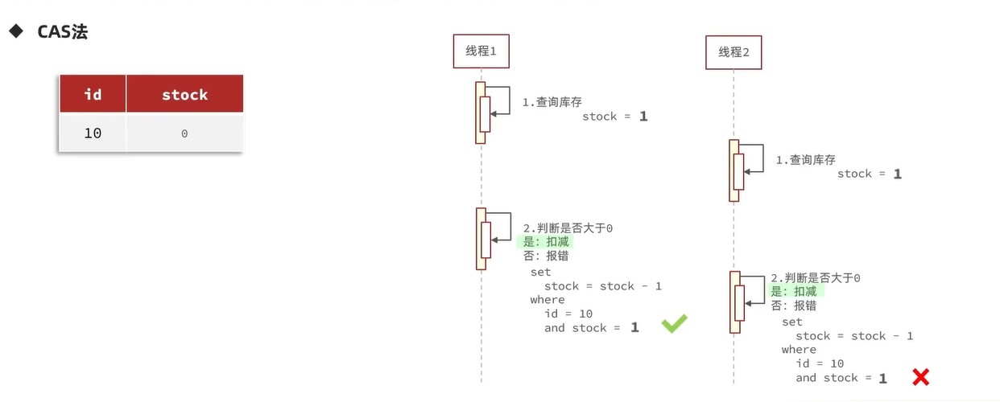

# 一、秒杀超卖问题的线程安全

超卖是典型的多线程安全问题，最常见的解决方案就是加锁

`数据库的锁，Syschronized，Lock都属于悲观锁，是在执行之前获取锁`

- 悲观锁：因为执行之前加了锁，所以导致所有的线程并行，性能不高

- **乐观锁：因为没有加锁，是通过判断数据有没有被修改的方式来确定是否进行下一步操作。所以性能比较高。**

## ①乐观锁的两种实现方法

> 乐观锁的关键就是判断之前查询到的数据有没有被修改过，如果被修改了就不执行对数据的操作，没有被修改就执行下一步操作

> 乐观锁用在更新数据的时候，无法用在插入数据时。因为乐观锁是根据查询的数据是否更改过来确定是否进行下一步操作的。对于新增操作来说，原始数据都没有，更别说去判断原始数据有没有被更改过了。

> 乐观锁CAS方案成功率太低，在操作数据之前判断查询的数据有没有被修改，高并发操作时大多数情况下都是被修改过的，可以使用分段锁解决成功率低的问题

# 二、秒杀分布式锁与单机锁

需求：一人一单。在高并发场景下，一个人只能购买一张优惠券

## ①单机锁

> 见Git-（秒杀-一人只能购买一张优惠券（只能解决单机模式的并发问题）
>
> 使用synchornized实现

## ②分布式锁

### Ⅰ、synchornized分布式下失效

> synchornized关键字在单机模式下可以锁住，但是分布式下无法保证线程安全问题的。因为synchornized是通过锁监视器实现的，而每个部署的机器内部都有一个锁监视器，并且只能监视本机的请求是否加锁，无法监视其他机器。当两个完全一样的请求负载均衡到不同的机器时，这两个请求就有可能都拿到锁并且操作数据。如下图

### **Ⅱ、分布式锁的原理**

> 分布式锁：满足分布式系统或则集群模式下多进程可见并且互斥的锁

### Ⅲ、分布式锁的实现方式

## ③使用Redis实现分布式锁

> 见Git代码 `秒杀-使用Redis实现分布式锁`
>
> 伪代码：利用redis的setnx的互斥性当作锁，设置一个过期时间用来做锁释放的兜底策略。当获取锁的时候使用setnx向redis存，释放锁的时候则删除setnx存的数据

**分布式锁的误释放**

> **分布式锁会存在误删的问题，解决的办法就是在获取锁的时候存入一个唯一标识，释放锁的时候把唯一标识取出来与存入的标识做对比，如果相同，说明这个锁属于当前线程，就有资格释放。**
>
> 
>
> 注意：判断锁是否属于自己、释放锁这两个操作应该具备原子性
>
> 可以使用Lua脚本调用redis命令来保证操作的原子性

④基于Redis的分布式工具Redisson

**使用setnx作为分布式锁有下面几个问题**

> Redisson是一个基于redis的分布式工具的集合，使用Redisson解决以上问题